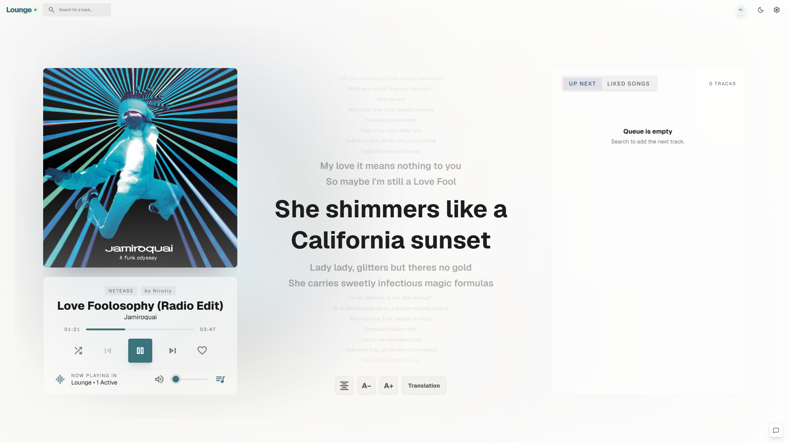
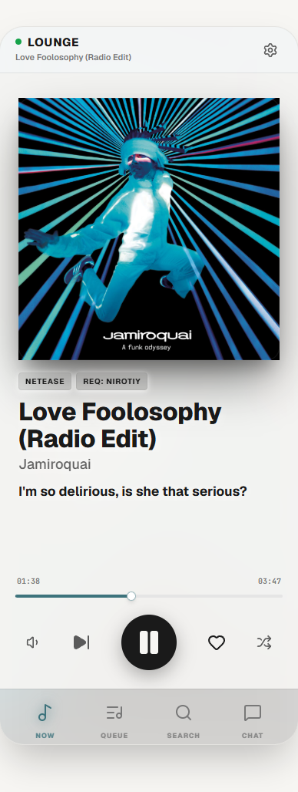

# MusicParty NRT

> 私有化部署的多人实时听歌房间。搜索、点歌、排队、聊天、歌词、移动端播放和可选直播流都在同一个 Web 应用里完成。

本仓库是基于上游 MusicParty 的个人 fork。NRT-Base 分支重点补强了前端 UI/UX、移动端体验、国际化、播放同步、队列操作、专辑导入、直播流稳定性和可选 Navidrome 私有曲库接入。


## 预览

> 截图文件放在 `docs/assets/readme/`。如果你在本地重新截图，只需要覆盖同名文件。





## 核心特性

- **多人同步播放**：基于 Spring Boot WebSocket/STOMP 分发播放状态，前端按服务端时间轴校准进度。
- **多音乐源**：支持网易云音乐、Bilibili；Navidrome 私有曲库可作为可选实验功能启用。
- **队列协作**：点歌、置顶、批量删除、喜欢歌曲、喜欢列表导出，以及防止单人霸榜的公平随机策略。
- **桌面与移动端 UI**：桌面三栏主界面，移动端底部导航与独立播放/队列/搜索/聊天视图。
- **歌词体验**：支持歌词和翻译歌词展示，移动端有独立的歌词面板和字号/对齐控制。
- **实时互动**：聊天室、系统消息、在线成员、点赞反馈和直播流听众计数。
- **房间控制**：支持房间密码、管理员命令、权限锁定、Cookie 动态更新和访问限流。
- **可选 HTTP 直播流**：通过 FFmpeg 输出 `/radio/stream`，适合在 VRChat 等外部场景收听。
- **i18n 与本地字体**：前端接入 `vue-i18n`，Material Symbols 字体已本地化，Docker 部署不依赖外部图标字体源。

## 快速部署

推荐直接使用 Docker Compose 从当前源码构建：

```bash
docker compose up -d --build
```

默认访问地址：

```text
http://localhost:8848
```

正式部署前至少修改这些环境变量：

```yaml
- ADMIN_PASSWORD=change-me
- BASE_URL=https://music.example.com
- NETEASE_COOKIE=
- BILIBILI_SESSDATA=
```

`BASE_URL` 必须是用户实际访问的完整地址，包含协议。直播流链接、部分后端生成的绝对 URL 都依赖它。

## 环境变量

| 变量名 | 必填 | 默认值 | 说明 |
| --- | --- | --- | --- |
| `ADMIN_PASSWORD` | 是 | `admin123` | 管理员命令密码。生产环境必须修改。 |
| `BASE_URL` | 否 | `http://localhost:8080` | 对外访问地址，生成直播流链接时使用。 |
| `APP_AUTHOR_NAME` | 否 | `ThorNex` | 页面品牌/作者名。 |
| `APP_BACK_WORDS` | 否 | `THORNEX` | 播放区背景装饰文字。 |
| `NETEASE_API_URL` | 是 | `http://netease-api:3000` | NeteaseCloudMusicApi 地址。 |
| `NETEASE_COOKIE` | 否 | 空 | 网易云 Cookie，用于更高音质或账号相关能力。 |
| `NETEASE_QUALITY` | 否 | `exhigh` | 网易云音质，可选 `standard`、`higher`、`exhigh`、`lossless`、`hires`。 |
| `BILIBILI_SESSDATA` | 否 | 空 | Bilibili SESSDATA，用于减少风控和提升解析能力。 |
| `QUEUE_MAX_SIZE` | 否 | `1000` | 队列最大长度。 |
| `QUEUE_HISTORY_SIZE` | 否 | `50` | 历史记录保留数量。 |
| `QUEUE_MAX_USER_SONGS` | 否 | `100` | 单用户最大排队歌曲数。 |
| `PLAYLIST_IMPORT_LIMIT` | 否 | `100` | 歌单/专辑导入时的歌曲数量上限。 |
| `CHAT_HISTORY_LIMIT` | 否 | `1000` | 聊天历史保留数量。 |
| `CHAT_MIN_INTERVAL` | 否 | `1000` | 聊天发送间隔，单位毫秒。 |
| `CHAT_MAX_LENGTH` | 否 | `200` | 单条聊天消息最大字符数。 |
| `CACHE_MAX_SIZE` | 否 | `1GB` | 本地媒体缓存上限，例如 `512MB`、`2GB`。 |
| `AUTH_RATE_LIMIT_ENABLED` | 否 | `true` | 是否启用密码验证限流。 |
| `AUTH_MAX_ATTEMPTS` | 否 | `5` | 密码验证最大失败次数。 |
| `AUTH_WINDOW_SECONDS` | 否 | `60` | 密码验证统计窗口。 |
| `AUTH_BLOCK_DURATION` | 否 | `300` | 触发限流后的封锁秒数。 |
| `NAVIDROME_ENABLED` | 否 | `false` | 是否启用 Navidrome 平台。 |
| `NAVIDROME_BASE_URL` | 否 | `http://navidrome:4533` | Navidrome 服务地址。 |
| `NAVIDROME_USERNAME` | 否 | 空 | Navidrome 用户名。 |
| `NAVIDROME_PASSWORD` | 否 | 空 | Navidrome 密码。 |
| `NAVIDROME_CLIENT` | 否 | `musicparty` | Subsonic 客户端名。 |
| `NAVIDROME_API_VERSION` | 否 | `1.16.1` | Subsonic API 版本。 |
| `NAVIDROME_ALLOWED_USERS` | 否 | 空 | 允许使用 Navidrome 的 MusicParty 用户名，逗号分隔。 |

## 管理员命令

在前端搜索框输入以下命令，提交后会要求输入 `ADMIN_PASSWORD`：

| 命令 | 说明 |
| --- | --- |
| `//LOCK <TYPE> <ON/OFF>` | 锁定控制权限。`TYPE` 可选 `PAUSE`、`SKIP`、`SHUFFLE`、`ALL`。 |
| `//PAUSE` | 管理员强制暂停/恢复播放。 |
| `//SKIP` | 管理员强制切歌。 |
| `//SHUFFLE` | 管理员强制切换随机模式。 |
| `//RESET` | 重置播放状态、队列和聊天记录，谨慎使用。 |
| `//CLEAR <QUEUE/CHAT>` | 清空队列或聊天历史。 |
| `//PASS <new_password>` | 设置房间密码。 |
| `//OPEN` | 取消房间密码，开放房间。 |
| `//STREAM ON` | 开启 HTTP 直播流。 |
| `//STREAM OFF` | 关闭 HTTP 直播流。 |
| `//COOKIE netease <cookie>` | 动态更新网易云 Cookie。 |
| `//COOKIE bilibili <sessdata>` | 动态更新 Bilibili SESSDATA。 |

聊天框命令：

```text
//stream
```

当直播流已开启时，用户可在系统消息中获得自己的 `/radio/stream?key=...` 收听链接。

> 直播流依赖 FFmpeg，会增加 CPU、内存和公网流量消耗。Bilibili 音频会经过本地缓存和服务端转发，也会消耗 VPS 流量。

## Navidrome 可选实验功能

Navidrome 用于接入私有曲库，不影响默认部署。启用示例：

```bash
docker compose -f docker-compose.yml -f docker-compose.navidrome.yml --env-file .env.navidrome up -d
```

访问边界：

- 只对 `NAVIDROME_ALLOWED_USERS` 中的非游客用户名开放。
- 用户名白名单是轻量房间信任模型，不是强身份认证。
- Navidrome 音频通过 MusicParty 后端代理给浏览器，Navidrome 凭据不会直接暴露给前端。
- 当前版本的 HTTP 直播流不支持 Navidrome 曲目，Navidrome 主要用于浏览器播放。

详细部署和 rclone 挂载说明见 [docs/navidrome-rclone.md](docs/navidrome-rclone.md)。

## 本地开发

### Git Bash 一键启动

Windows 本地推荐使用 Git Bash：

```bash
./start-dev.sh --start-netease-api
```

默认启动：

```text
后端：http://localhost:8080
前端：http://127.0.0.1:5173
网易云 API：http://127.0.0.1:3000
```

移动端预览：

```text
http://127.0.0.1:5173/?mobilePreview=1
```

如果你使用本地 Navidrome：

```bash
./start-dev.sh --navidrome-local
```

### Cookie 配置

本地调试可以把 Cookie 放在忽略提交的 `cookies.json`：

```json
{
  "neteaseCookie": "MUSIC_U=xxxx...; __csrf=xxxx...",
  "bilibiliSessdata": ""
}
```

也可以通过环境变量传入：

```bash
export NETEASE_COOKIE="MUSIC_U=xxxx...; __csrf=xxxx..."
./start-dev.sh --start-netease-api
```

运行中也可以用管理员命令动态更新：

```text
//COOKIE netease MUSIC_U=xxxx...; __csrf=xxxx...
```

### 手动启动

前端：

```bash
cd music-party-web
npm install
npm run dev
```

后端：

```bash
mvn spring-boot:run
```

生产构建：

```bash
cd music-party-web
npm run build
cd ..
mvn clean package -DskipTests
```

## 技术栈

- 后端：Java 21、Spring Boot 3.2、WebSocket/STOMP、WebFlux、FFmpeg
- 前端：Vue 3、Vite 7、Pinia、Tailwind CSS、vue-i18n、lucide-vue-next、Material Symbols 本地字体
- 部署：Docker、Docker Compose，可选 Cloudflare Tunnel、Navidrome、rclone

## 免责声明

- 本项目仅供学习交流和个人自托管使用，请勿用于商业用途。
- 网易云音乐、Bilibili、Navidrome/Subsonic 等接口能力取决于第三方服务和账号状态，项目不保证可用性。
- Bilibili 与网易云相关 Cookie/Sessdata 请自行妥善保管，不要提交到仓库。
- 请尊重版权，支持正版音乐。

## License

上游 README 标注为 MIT License。当前仓库根目录暂未包含独立 `LICENSE` 文件，正式发布前建议补齐许可证文件以避免分发歧义。
