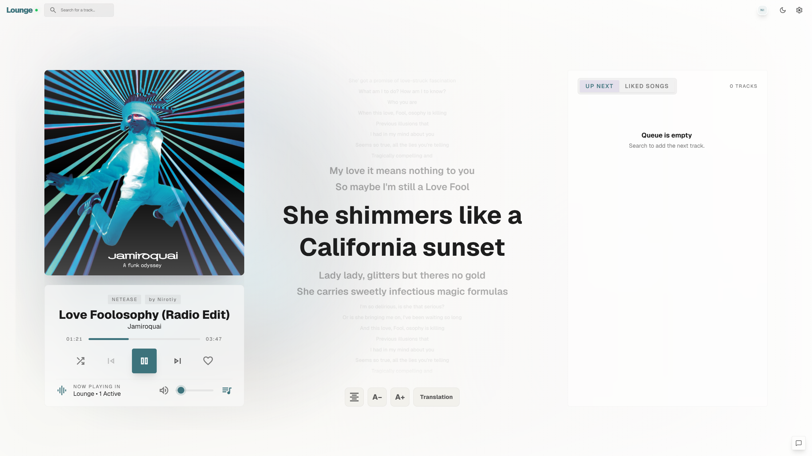
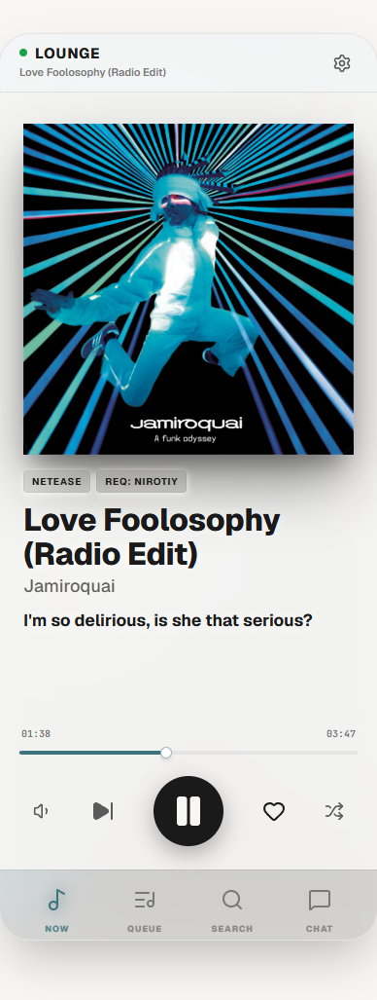

# MusicParty NRT

> 一个面向自托管场景的多人实时听歌房间。搜索、点歌、同步播放、歌词、队列、聊天和房间管理都在同一个 Web 应用中完成。

[](https://github.com/BigBlackBlob/MusicParty/actions/workflows/ci.yml)


MusicParty NRT 是基于上游 MusicParty 持续演进的个人 fork。当前主线已经完成 Go-only 重构：Go 后端是唯一运行时，Vue 前端通过生成契约连接 HTTP 与 WebSocket，SQLite 保存账号、房间和播放数据，Docker 镜像同时发布到 GHCR 与阿里云 ACR。

## 界面预览





## 能做什么

- **多人同步播放**：房间级 WebSocket 运行时维护权威播放快照、队列版本、在线成员和服务端时间锚点；断线、页面恢复和版本间隙会触发 resync。
- **多房间与访问控制**：支持公开房间、私有房间、房主权限、平台管理员权限和房间级访问 Cookie。
- **访客、邀请与管理员入口**：访客可快速进入；邀请码用于建立持久成员身份；本地平台管理员使用账号密码登录。
- **协作队列**：支持点歌、拖拽重排、置顶、批量操作、ACK/NACK 回滚和防止单用户占满队列的限制。
- **音乐平台**：支持网易云、Bilibili、YouTube、本地媒体以及多个 Subsonic/Navidrome 源。第三方平台是否可用取决于对应服务和凭据状态。
- **歌词**：网易云歌词、翻译歌词、自动滚动、字号和对齐调节在桌面端与移动端共用同一套歌词状态。
- **歌单与喜欢歌曲**：支持个人歌单、房间歌单、喜欢歌曲、外部歌单导入以及队列批量加入。
- **实时聊天与成员状态**：房间聊天、公共聊天、系统事件、在线成员和未读状态相互隔离并实时更新。
- **本地媒体库**：授权用户可以上传音频；后端负责元数据、封面、转码、缓存和代理播放。
- **桌面自由布局**：Now Playing、歌词、队列、聊天、成员和房间歌单等模块可自由组合、拖拽并保存布局。
- **移动端与 Lite Mode**：独立移动端 shell、底部导航、完整播放页和轻量模式共享相同领域状态。
- **中英文与无障碍**：主要流程支持中英文、键盘焦点、按钮语义和可访问名称。

## 访问模型

MusicParty 使用后端签发的 HttpOnly Cookie，不把认证 token 暴露给浏览器脚本。

| 身份 | 典型能力 |
| --- | --- |
| 访客 | 进入允许的房间、听歌、点歌和聊天 |
| 邀请成员 | 持久身份、个人歌单、喜欢歌曲和受授权的私有音源 |
| 房主 | 管理当前房间、密码、成员、邀请和房间歌单 |
| 平台管理员 | 管理站点平台凭据、媒体源、上传权限和所有房间 |

首次启动通过 `BOOTSTRAP_ADMIN_USERNAME` 与 `BOOTSTRAP_ADMIN_PASSWORD` 建立平台管理员。邀请码可以在设置中心的房间管理区域创建和撤销。

## Docker 快速部署

### 1. 准备配置

```bash
git clone -b NRT-Base https://github.com/BigBlackBlob/MusicParty.git
cd MusicParty
cp .env.example .env
```

至少设置以下内容：

```dotenv
MUSIC_PARTY_IMAGE=ghcr.io/bigblackblob/musicparty@sha256:<immutable-digest>
NETEASE_API_IMAGE=binaryify/neteasecloudmusicapi:4.21.3
BASE_URL=https://music.example.com
ALLOWED_ORIGINS=https://music.example.com
BOOTSTRAP_ADMIN_USERNAME=admin
BOOTSTRAP_ADMIN_PASSWORD=replace-with-a-strong-password
```

生产环境必须使用 GitHub Actions 摘要中的不可变 digest。`nrt-base` 是滚动标签，只适合临时验证。

如果服务器访问 GHCR 不稳定，可以使用同一次构建发布到阿里云 ACR 的相同镜像：

```dotenv
MUSIC_PARTY_IMAGE=crpi-533x5q1t88ew0x21.cn-hangzhou.personal.cr.aliyuncs.com/nrt-base/nrt-music-party@sha256:<immutable-digest>
```

### 2. 检查目录权限

镜像默认以 `10001:10001` 运行。确保以下 bind mount 对配置的 UID/GID 可写：

```text
./music_party/data
./music_party/cached_media
```

已有部署可以显式设置 `MUSIC_PARTY_RUNTIME_UID` 和 `MUSIC_PARTY_RUNTIME_GID`，继续使用原数据目录的 owner。

### 3. 启动

```bash
docker compose config --quiet
docker compose pull
docker compose up -d
curl --fail http://127.0.0.1:8848/actuator/health/readiness
```

默认访问地址为 `http://localhost:8848`。

从源码构建本地镜像：

```bash
docker compose -f docker-compose.yml -f docker-compose.build.yml up -d --build
```

## 更新与回滚

每次 `NRT-Base` 应用代码推送必须依次通过契约、Go、race、前端、Playwright、容器 readiness 和安全扫描，随后才会把同一镜像发布到 GHCR 与 ACR。GitHub Actions **不会自动部署 VPS**。

更新流程：

1. 从成功的 CI 摘要复制不可变 digest。
2. 在涉及数据库迁移时先创建并验证 SQLite 快照。
3. 更新部署环境中的 `MUSIC_PARTY_IMAGE`。
4. 拉取并重建容器。
5. 验证 readiness、登录、房间连接、在线人数、队列、聊天和启用的平台。

回滚使用上一份已知正常的 Go digest；如果版本修改过 schema，同时恢复对应的迁移前数据库快照。旧 Java 镜像不是受支持的回滚目标。

详细说明见 [发布流程](docs/release-process.md) 和 [运维手册](docs/operations.md)。

## 本地开发

要求：

- Go 1.26
- Node.js 22
- pnpm 11.10.0
- 可选 FFmpeg、Docker Desktop

Go + Vite：

```bash
./start-dev.sh
```

同时启动固定版本的本地网易云 API：

```bash
./start-dev.sh --start-netease-api
```

其他常用模式：

```bash
./start-dev.sh --navidrome-local
./start-dev.sh --backend-only --skip-browser
./start-dev.sh --frontend-only --env-file .env.local
```

默认端口：

| 服务 | 地址 |
| --- | --- |
| Go API | `http://127.0.0.1:18081` |
| Vite | `http://127.0.0.1:5173` |
| Netease API | `http://127.0.0.1:3000` |

Windows 可以使用：

```powershell
.\scripts\fresh-start.ps1 -StartNeteaseApi
```

启动器只管理它记录在 `.dev-logs/pids` 中、且命令行属于当前仓库的进程。`.env.local`、`cookies.json`、运行数据库、媒体缓存和日志均被 Git 忽略。

## 验证

后端完整门禁：

```bash
cd backend-go
./ci/verify.sh
```

前端：

```bash
cd music-party-web
pnpm install --frozen-lockfile
pnpm typecheck
pnpm lint
pnpm test:run
pnpm build
pnpm audit --audit-level=moderate --registry=https://registry.npmjs.org
```

隔离容器与 Playwright：

```bash
./local-verification.sh
```

视觉截图包含 Linux CI 与 Windows 本地两套基线，不应未经人工审查自动更新。

## 架构概览

```text
Vue 3 / Vite / Pinia / TanStack Vue Query
              │
      typed HTTP + WebSocket
              │
Go / Chi / room-scoped realtime runtime
              │
 serialized SQLite writer + media pipeline
              │
Netease / Bilibili / YouTube / Local / Subsonic
```

- Go 拥有 HTTP、WebSocket、环境变量和后续 SQLite migration 的契约。
- 生成的 TypeScript 类型位于 `music-party-web/src/contracts/generated/`，禁止手工修改。
- TanStack Vue Query 管理 HTTP 服务端资源；Pinia 管理会话、当前房间、实时状态、本地音频、布局和偏好。
- 根目录 `Dockerfile` 是唯一镜像定义，容器内包含 Go 应用、静态前端、`dbcheck`、`dbsnapshot`、FFmpeg 和 yt-dlp。

更多内容：

- [架构说明](docs/architecture.md)
- [Go-first 前端边界](docs/go-first-frontend.md)
- [本地验证](docs/local-verification-guide.md)
- [手工验收清单](docs/manual-acceptance.md)
- [Navidrome 与 rclone](docs/navidrome-rclone.md)
- [Java 后端退役说明](docs/java-retirement.md)
- [工程 Roadmap](ROADMAP.md)

## 数据与安全

- SQLite 数据库、媒体缓存、平台 Cookie、`.env` 和本地构建产物不得提交到 Git。
- Netease Cookie、Bilibili SESSDATA、YouTube API key 和 Subsonic 凭据应通过管理员设置或未跟踪环境配置提供。
- 设置页保存的平台 secret 不会回传明文；日志和问题报告中也不应包含凭据。
- 备份应与对应镜像 digest 一起记录 SHA-256，并在仓库外保存。
- 不要对生产数据库运行测试、契约生成器或手工 schema 实验。

完整环境变量契约见 [`contracts/config/environment.yaml`](contracts/config/environment.yaml)。

## 项目状态

当前维护分支为 `NRT-Base`。Java 后端、Maven 构建和旧迁移验收入口已从活跃主线退役。历史迁移结论保存在 [迁移摘要](docs/migration-archive-summary.md) 中。

## 免责声明

- 本项目用于学习、交流和个人自托管，请遵守所在地法律及第三方平台条款。
- 音乐搜索、播放和歌词能力依赖第三方服务，项目无法保证其长期可用性。
- 请妥善保护账号 Cookie、API key 和私有媒体，并尊重内容版权。

## License

上游项目说明为 MIT License，但当前仓库根目录尚未包含独立 `LICENSE` 文件。在补齐许可证文件前，请不要把 README 中的说明视为完整的法律授权文本。
